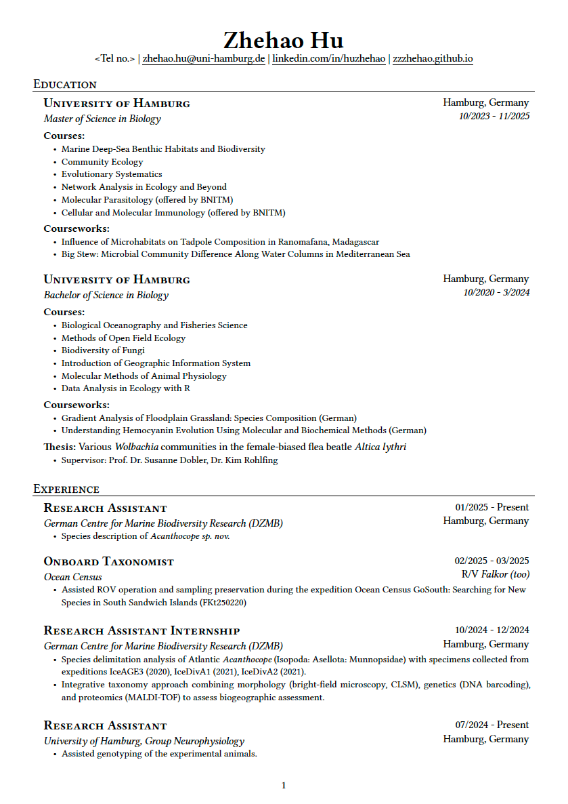
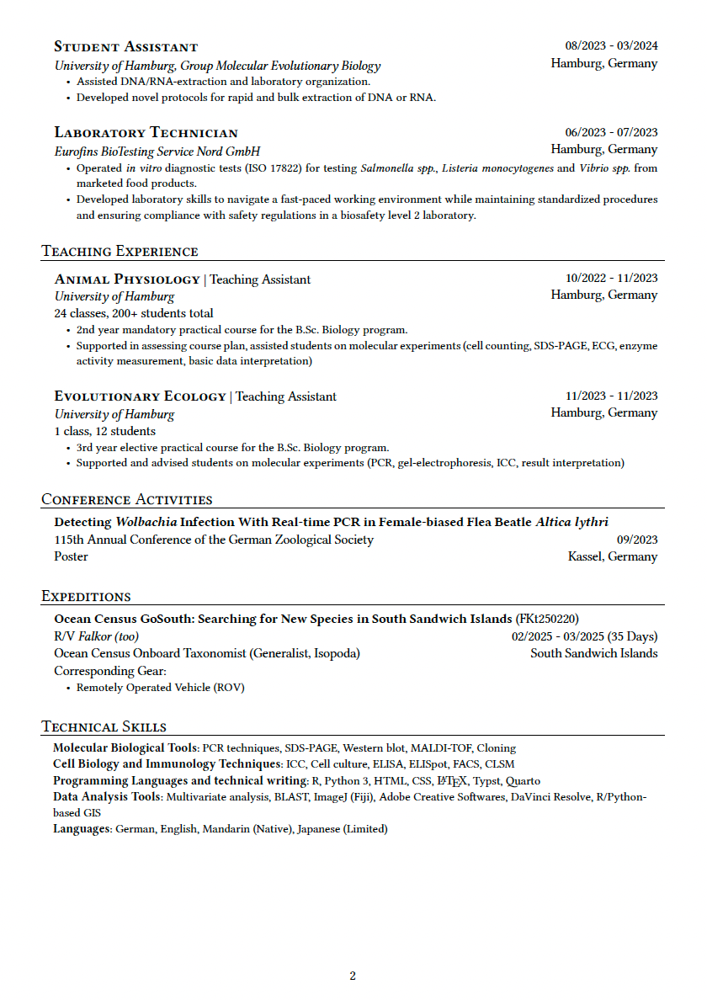

A CV template for early-career scientists (like myself). 

This template is modified based on [NNJR](https://github.com/tzx/NNJR).

Contents are directly written in raw Typst in `CV.qmd`, while formatting and layout are managed in `template.typ`. Each section heading and the first of its content are enclosed in unbreakable block to avoid heading to be placed at the end of a page.

An example pdf [here](./CV_censored.pdf)

```typst
#set block(breakable: false)
#block[
// items
]
```

## Example



