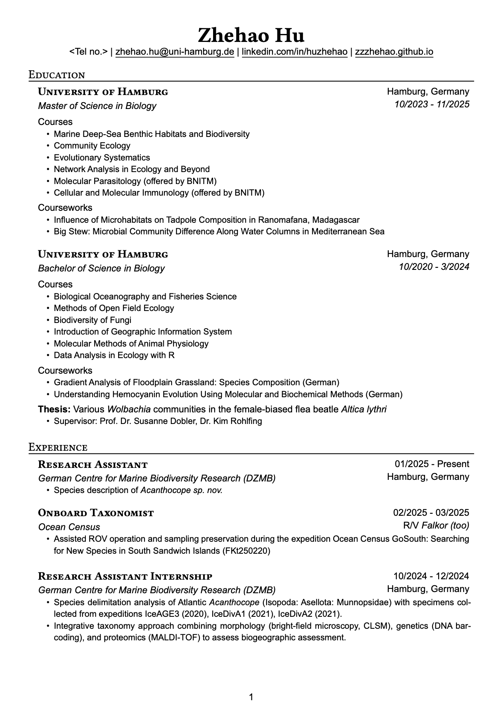

A CV template for early-career scientists (like myself). 

This template is modified based on [NNJR](https://github.com/tzx/NNJR).

Final compiling is done by [Quarto](https://quarto.org).

Contents are directly written in raw Typst in `CV.qmd`, while formatting and layout are managed in `template.typ`. Each section heading and the first of its items are enclosed in an unbreakable block to avoid headings to be placed at the end of a page.


```typst
#set block(breakable: false)
#block[
// Heading
// Item 1
]
```

## Example

You may find the demo pdf [here](./CV_censored.pdf)



